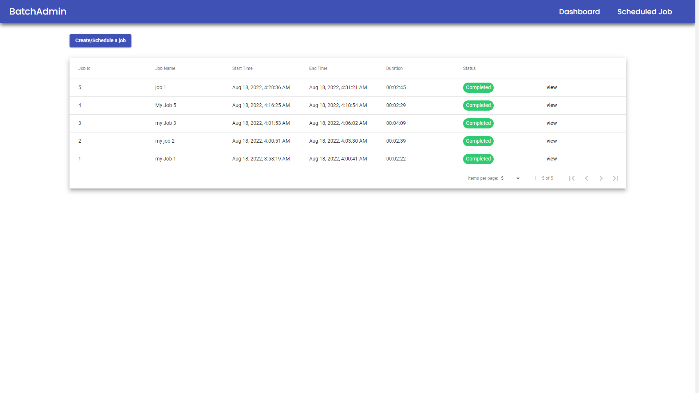

# Spring Batch UI

Configure and manage job executions

## Run Locally

Go to the project directory

```bash
  cd SpringBatchAdmin
```

Install dependencies

```bash
  npm install
```

Start the server

```bash
  ng serve --open
```


## Screenshots



