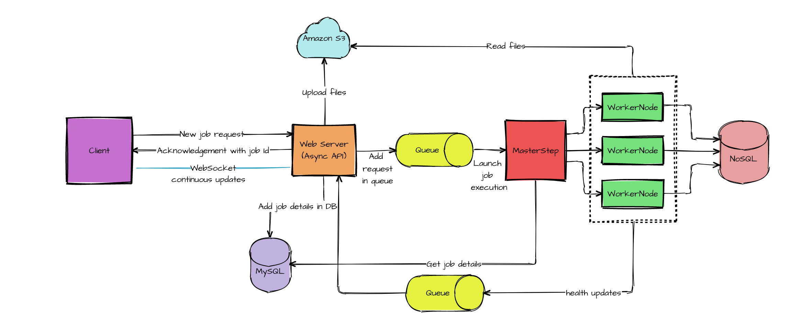

# Batch Processing

A batch Processing application developed using Spring Batch to  parallely process large csv files containing millions of records and store them in the database using master-worker approach.

## Features
- Admin UI to configure and manage jobs
- Restartability (Continue where you left off)
- Job Scheduling
- Worker nodes live updates and health monitoring
- View worker execution logs
- CSV parser to detect CSV fields data type
- View database schema
- Email alerts

## Tech Stack

**Client:** Angular

**Server:** Spring Boot, Spring Batch,  Apache Kafka, Amazon S3, Websockets

**database:** MySQL, MongoDB

## System Architecture

## Demo

## Authors

- [Anushree Shah](https://github.com/anushreeshah2405)
- [Gajendra Raut](https://github.com/Gajendra18)
